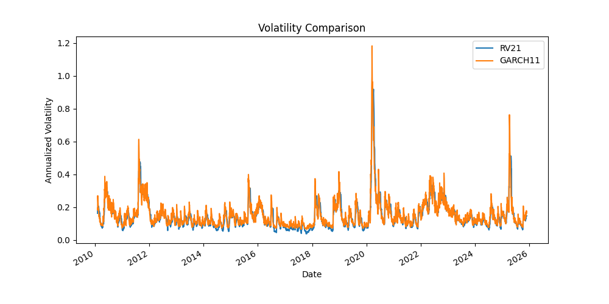
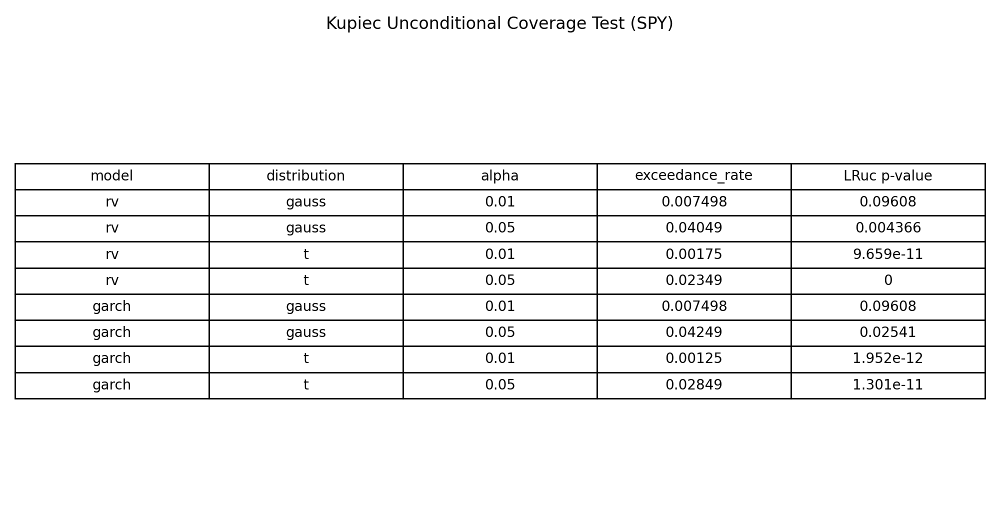
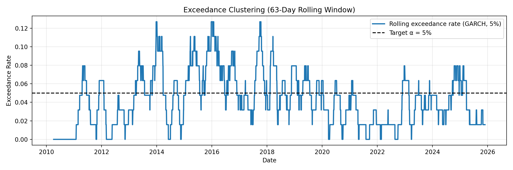
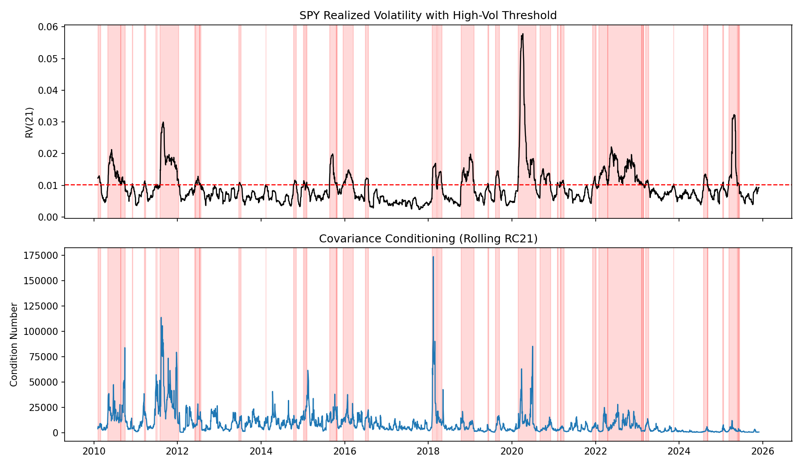

# Volatility and Covariance Baseline Lab (SPY + Liquid ETFs)

TL;DR: A reproducible volatility and covariance risk pipeline for SPY + liquid ETFs: realized volatility vs GARCH forecasts, covariance fragility diagnostics (eigenvalues/condition number), explicit SPD enforcement (jitter/eigen clipping), VAR innovation covariance, and walk-forward VaR backtests with saved figures and tests.

The goal of this project is to build baseline volatility and covariance plumbing in a clean, reproducible way using Python scripts.

This project's goal is not about modeling complexity or "alpha claims."  The intent is to build baseline components that a portfolio construction or systematic pipeline would consume, without making performance claims. I am trying to work through:
- basic definitions (returns, realized volatility, sample covariance),
- comparisons (forecast vs realized proxy),
- numerical diagnostics (covariance fragility),
- project structure (scripts, configs, deterministic outputs).

**Focus:** volatility and covariance as risk objects that are commonly used as inputs to portfolio construction and sizing.
**Not included:** option pricing, Ito calculus, complex deep forecasting, or research-only abstractions.

---

## What this project includes

The project currently includes:
- Baseline volatility models compared to realized proxies
- Covariance treated as a potentially fragile risk object
- Conditioning diagnostics via eigenvalues and condition number
- SPD regularization techniques (diagonal jitter, eigenvalue clipping) with Cholesky validation
- Scripts with configs
- Reproducible artifacts (figures saved to disk, deterministic paths)
- Unit tests for SPD repair functions

---

## Repo structure

```
spy-volatility-clustering-and-garch/
├── configs/                    # Configuration files
│   ├── default.yaml           # single-asset (SPY)
│   └── default_multivar.yaml  # multivariate prices for covariance diagnostics
│
├── data/                       # generated artifacts live here
│   ├── spy/                   # SPY price data storage
│   │   └── spy_prices.csv     # cached SPY prices
│   └── outputs/
│       └── figures/           # Visualization outputs
│           ├── SPY_log_returns.png
│           ├── SPY_realized_volatility.png
│           ├── SPY_GARCH11_VS_RV21.png
│           ├── prices_covariance_fragility.png
│           ├── regularized_covariance_condition_number.png
│           ├── rolling_vs_var_cov_diagnostics.png
│           ├── var_garch_99.png
│           ├── var_lruc_table.png
│           ├── exceedance_clustering.png
│           └── vol_regimes_diagnostic.png
│
├── datasets/                   # Additional datasets (if any)
│
├── notebooks/                  # Jupyter notebooks for analysis
│   └── volatility_basics.ipynb
│
├── scripts/                    # entrypoints (what gets run)
│   ├── test_load_spy.py
│   ├── print_config.py
│   ├── compute_returns_and_rv.py
│   ├── fit_garch.py
│   ├── fit_var.py
│   ├── diagnose_covariance.py
│   ├── regulate_covariance.py
│   ├── walkforward_var.py
│   └── volatility_regime_diagnostic.py
│
├── tests/                      # Unit tests
│   └── test_spd.py
│
├── src/                        # Source code
│   └── spy_volatility/        # Main package
│       ├── __init__.py
│       ├── data/              # Data loading and processing modules
│       │   ├── __init__.py
│       │   ├── loaders.py    # Yahoo Finance download + caching (single/multi-asset)
│       │   └── features.py   # returns + realized volatility
│       ├── models/            # GARCH and volatility models
│       │   ├── __init__.py
│       │   ├── garch_models.py  # GARCH baselines (currently GARCH(1,1))
│       │   └── var.py           # VAR models (currently VAR(1))
│       ├── risk/              # Risk metrics and portfolio analysis
│       │   ├── __init__.py
│       │   ├── cov_metrics.py   # rolling sample covariance + diagnostics
│       │   └── spd.py           # SPD regularization (jitter, eigenvalue clipping, Cholesky checks)
│       ├── training/          # Model training utilities
│       │   └── __init__.py
│       └── utils/             # Utility functions
│           ├── __init__.py
│           └── config.py     # config loading + project root
│
├── requirements.txt
├── setup.py
└── README.md
```

---

## Installation

```bash
git clone <repository-url>
cd spy-volatility-clustering-and-garch

python -m venv .venv
source .venv/bin/activate

pip install -U pip
pip install -r requirements.txt
pip install -e .
```

### Dependencies

- `pandas`, `numpy` 
- `matplotlib`
- `yfinance`
- `arch`
- `statsmodels`
- `pyyaml`

---

## Configuration

Configs live in `configs/`.

- `default.yaml`: SPY single asset pipeline
- `default_multivar.yaml`: multivariate prices for covariance diagnostics

Example single-asset config:
```yaml
data:
  root_dir: "data"
  spy_prices_file: "data/spy/spy_prices.csv"
  spy_ticker: "SPY"
  start_date: "2010-01-01"
  end_date: null  # null = use today's date when running
```

Example multivariate config (used for covariance diagnostics):
```yaml
data:
  prices_file: "data/prices/multivar_prices.csv"
  ticker: ["SPY", "XLF", "XLK", "XLE", "XLY", "XLP", "XLI", "XLU", "XLV", "XLB"]
  start_date: "2010-01-01"
  end_date: null
```

---

## How to run (scripts only)

### 0) Sanity check config resolution
```bash
python scripts/print_config.py
```

### 1) Volatility clustering diagnostics (returns + RV)

The goal here is to compute log returns and an annualized realized volatility proxy (default RV(21)), then save figures.

```bash
python scripts/compute_returns_and_rv.py
```

**Outputs:**
- `data/outputs/figures/SPY_log_returns.png`
- `data/outputs/figures/SPY_realized_volatility.png`

**Results:** The figures illustrate volatility clustering and regime persistence, showing that squared returns and realized volatility exhibit the characteristic pattern where periods of high volatility cluster together.


### 2) GARCH(1,1) baseline vs realized volatility

The goal is to fit a GARCH(1,1) model and compare conditional volatility to RV(21).

```bash
python scripts/fit_garch.py
```

**Output:**
- `data/outputs/figures/SPY_GARCH11_VS_RV21.png`

**Results:** This comparison emphasizes the distinction between model-based forecasts (GARCH conditional volatility) and realized proxies (RV). The figure shows how the GARCH model captures volatility dynamics compared to the ex-post realized measure.



**Note:** this is a diagnostic comparison, not walk-forward evaluation yet.

### 3) Covariance fragility diagnostics

The goal is to compute rolling sample covariance matrices and check numerical properties over time.

```bash
python scripts/diagnose_covariance.py
```

**Output:**
- `data/outputs/figures/prices_covariance_fragility.png`

**Results:** The analysis shows that rolling sample covariance matrices for even liquid ETFs are often numerically fragile. Small eigenvalues approach zero (or even go negative numerically), and condition numbers spike dramatically in stressed periods, making these matrices unsafe for direct use in optimization or risk allocation.


### 4) SPD regularization

The goal is to apply explicit SPD (symmetric positive definite) regularization techniques to make covariance matrices numerically usable.

```bash
python scripts/regulate_covariance.py
```

**Output:**
- `data/outputs/figures/regularized_covariance_condition_number.png`

**Results:** This demonstrates that simple numerical fixes (diagonal jitter and eigenvalue clipping) dramatically improve covariance conditioning without changing the underlying estimator. The figure compares condition numbers for raw, jittered, and clipped covariance matrices over time, showing that explicit SPD repairs make covariance matrices safe for Cholesky decomposition and subsequent use in risk systems.


**Key insight:** in practice, numerical usability can be as important as estimation, especially in stressed regimes. Diagonal jitter stabilizes near-singular matrices by shifting the spectrum upward, while eigenvalue clipping enforces a hard lower bound and guarantees SPD by construction.

### 5) VAR(1) innovation covariance vs rolling sample covariance

The goal is to fit a VAR(1) model and compare the innovation covariance to rolling sample covariance.

```bash
python scripts/fit_var.py
```

**Output:**
- `data/outputs/figures/rolling_vs_var_cov_diagnostics.png`

**Results:** Compared to rolling sample covariance, the VAR(1) innovation covariance exhibits a smaller condition number with a reduced largest eigenvalue and an elevated smallest eigenvalue, indicating improved conditioning after removing linear temporal dependence in the conditional mean.


### 6) Walk-forward VaR evaluation

One-day VaR forecasts for SPY were evaluated using both realized volatility and GARCH(1,1) conditional volatility estimates under Gaussian and Student-t distributional assumptions at the 1% and 5% levels. The analysis was conducted in a walk-forward manner to avoid lookahead bias.

```bash
python scripts/walkforward_var.py
```

**Outputs:**
- `data/outputs/figures/var_garch_99.png`
- `data/outputs/figures/var_lruc_table.png`
- `data/outputs/figures/exceedance_clustering.png`

**Results:** The walk-forward VaR evaluation provides a comprehensive assessment of forecast accuracy across different volatility models and distributional assumptions.


In the 99% GARCH VaR backtest, extreme exceedances appear to occur primarily during periods of elevated market volatility. While some exceedances are temporally proximate, the limited number of 1% violations makes it difficult to draw strong conclusions regarding tail clustering based on visual inspection alone.



When comparing volatility models, GARCH-based VaR forecasts tend to show improved coverage relative to realized-volatility-based VaR. This behavior is consistent with the expectation that the GARCH(1,1) structure introduces smoother and more adaptive volatility estimates through its recursive variance dynamics, whereas rolling realized volatility responds more slowly to changes in volatility regimes.

Examining empirical exceedance rates and Kupiec unconditional coverage test results, Gaussian-based VaR forecasts appear to be more conservative in this setting, with exceedance frequencies closer to nominal levels. Student-t VaR, implemented with a fixed degrees-of-freedom parameter (ν = 8), exhibits low p-values in several cases, which may indicate miscalibration under this specific tail parameterization rather than an absence of fat-tailed behavior in equity returns. These results are therefore conditional on the chosen ν and should not be interpreted as a general rejection of heavy-tailed models.



Finally, rolling exceedance rates at the 5% level using a 63-day window suggest only mild persistence in VaR violations for the GARCH-Gaussian model. This may reflect the extent to which volatility clustering in returns is already absorbed by the conditional variance dynamics, although the rolling diagnostic is intended as an exploratory visualization rather than a formal test of independence.

### 7) Volatility regime covariance diagnostics

The goal is to examine how covariance conditioning varies across volatility regimes by using SPY realized volatility as a simple regime indicator.

```bash
python scripts/volatility_regime_diagnostic.py
```

**Output:**
- `data/outputs/figures/vol_regimes_diagnostic.png`

**Results:** This analysis examines the relationship between volatility regimes and covariance fragility by labeling periods of high volatility (using the 70th percentile of SPY realized volatility) and tracking the condition number of rolling covariance matrices across these regimes.



Using SPY realized volatility as a simple regime indicator, I find that rolling covariance matrices tend to become poorly conditioned during high-volatility periods. In these regimes, the condition number increases as the dominant eigenvalue expands and the smallest eigenvalues compress, consistent with assets moving more closely together. This does not imply causality, but it highlights a practical risk issue: covariance estimates are most fragile precisely when markets are volatile, which is why explicit SPD enforcement and regime-aware diagnostics are important in practice.

---

## Results and findings

The project follows a progression that builds understanding of volatility and covariance as practical risk objects:

1. **Volatility clustering visualization**: We begin by visualizing SPY log returns and realized volatility to illustrate volatility clustering and regime persistence. The figures show clear periods where high volatility clusters together, which is fundamental to understanding volatility dynamics.

2. **Forecast vs realized comparison**: We fit a GARCH(1,1) baseline and compare its conditional volatility to realized volatility, emphasizing the distinction between model-based forecasts and realized proxies. The comparison shows how GARCH captures volatility dynamics relative to ex-post measures.

3. **Covariance fragility demonstration**: Moving to the multivariate setting, we show that rolling sample covariance matrices for even liquid ETFs are often numerically fragile, with small eigenvalues and extreme condition numbers that make them unsafe for direct use. The diagnostics reveal that sample covariance can become ill-conditioned during stressed periods.

4. **SPD regularization results**: We demonstrate that simple, explicit SPD regularization techniques (diagonal jitter and eigenvalue clipping) substantially improve covariance conditioning. The results show that these minimal numerical repairs dramatically improve stability without changing the underlying estimator, highlighting that in practical risk systems the primary challenge is not estimating covariance, but making it numerically usable.

5. **VAR innovation covariance comparison**: We fit a VAR(1) model and compare the innovation covariance to rolling sample covariance. Compared to rolling sample covariance, the VAR(1) innovation covariance exhibits a smaller condition number with a reduced largest eigenvalue and an elevated smallest eigenvalue, indicating improved conditioning after removing linear temporal dependence in the conditional mean.

6. **Walk-forward VaR evaluation**: We evaluate one-day VaR forecasts using both realized volatility and GARCH(1,1) conditional volatility under Gaussian and Student-t assumptions. The walk-forward analysis shows that GARCH-based VaR tends to provide improved coverage relative to realized-volatility-based VaR, consistent with the GARCH structure's adaptive volatility dynamics. The Kupiec unconditional coverage tests and rolling exceedance diagnostics provide complementary assessments of forecast calibration and violation clustering.

7. **Volatility regime covariance diagnostics**: We examine how covariance conditioning varies across volatility regimes by using SPY realized volatility as a regime indicator. The analysis reveals that rolling covariance matrices become poorly conditioned during high-volatility periods, with condition numbers spiking when assets move more closely together. This highlights the practical risk issue that covariance estimates are most fragile precisely when markets are volatile, emphasizing the importance of explicit SPD enforcement and regime-aware diagnostics.

## Key concepts

### Forecast vs realized proxy

The goal is to keep these concepts distinct:
- **GARCH conditional volatility** is a model-based estimate (a forecast object).
- **Realized volatility (RV)** is a proxy built from future returns over a window (a realized object).

Keeping these distinct seems important in risk modeling.

### Covariance fragility and SPD regularization

The goal here is to understand that even for liquid ETFs, rolling sample covariance can become ill-conditioned and unstable. This project implements two production-style SPD repair techniques:
- **Diagonal jitter**: Stabilizes near-singular matrices by shifting the spectrum upward through a small diagonal addition.
- **Eigenvalue clipping**: Enforces a hard lower bound on eigenvalues and guarantees SPD by construction through eigendecomposition and reconstruction.

Both techniques are validated via Cholesky decomposition tests to ensure matrices are numerically usable. SPD enforcement and numerical repairs seem useful before using covariance in risk allocation or optimization.

---

## Development notes

A few organizational choices I made:
- Library code lives in `src/spy_volatility/`.
- Scripts under `scripts/` are the official entrypoints.
- Generated artifacts go under `data/` (safe to delete and regenerate).
- `pip install -e .` is used for an editable install so scripts can import the package cleanly.
- Unit tests in `tests/` validate SPD repair functions with various edge cases (singular matrices, indefinite matrices, near-singular numerics).

## Next steps (planned)

Some things I'd like to add:
- Minimal risk application (vol targeting / risk parity) with turnover reporting
- Extended testing of regularization techniques on various market conditions

---

## License

TBD

## Author

Jim Lim
